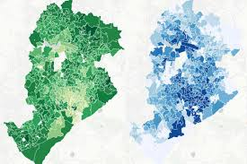

````{r setup, include=FALSE}
options(htmltools.dir.version = FALSE)
knitr::opts_chunk$set(messagwese=FALSE, warning = FALSE)
xaringanthemer::style_mono_accent(base_color ="#23395b", 
                                  title_slide_text_color="#23395b", 
                                  title_slide_background_color = "#fbf9f4", 
                                  background_color = "#fbf9f4", 
                                  link_color =  "#F21A00", 
                                 code_font_size = "60%")

options(htmltools.dir.version = FALSE)
knitr::opts_chunk$set(message=FALSE, warning = FALSE, error=TRUE)

``` 
class: center, middle

# Why are we here?

--

### Data, data, data, data ....

--
---

class: center, middle

```{r  echo=FALSE, out.width = "80%"}
knitr::include_graphics("data_store.png") 
```
---

# Smartphone Data

```{r  echo=FALSE, out.width = "100%"}
knitr::include_graphics("mob_01.png") 
```

---

# Social Media and Networks

```{r  echo=FALSE, out.width = "100%"}
knitr::include_graphics("redes.png") 
```

---

## Electoral Data

```{r  echo=FALSE, out.width = "100%"}
 
```

---

## Text-as-Data

.pull-left[
```{r  echo=FALSE, out.width = "100%"}
knitr::include_graphics("camara.png") 
```
]

.pull-right[
```{r  echo=FALSE, out.width = "100%"}
knitr::include_graphics("tweets.png") 
```
]

---

## On-line Surveys

```{r  echo=FALSE, out.width = "70%"}
knitr::include_graphics("survey.png") 
```

---

class: center, middle

```{r  echo=FALSE, out.width = "100%"}
 
```

---

class: center, middle


# Why are we here II ? 

#### if the data argument was not enough for you

---
class: center, middle

### Better opportunities in the academic and non-academic market for researchers who feel confortable working with large, new, and unstructured datasets. 


---


## Social Sciences in the Digital Era: Positives

- Plenty of data for free and easy access.

- New data Allows you to ask new questions.

- And also to find new answers to old questions.

- Higher Computational Power: New methods, more powerful, faster, and more accessible computers.

---

## Social Sciences in the Digital Era: Challenges

- Bigm Digital Data requires more technical training. 

- Computer Scientists care more about performance. 

- Social Scientists care more about theoretically relevant questions.

- Build more interdisciplinary  is hard at the personal, and institutional level. 

---

class: center, inverse, middle

### Our main goal during these two weeks to [introduce students]() to the basics of working with big data in the field of Computational Social Sciences (CSS). We will focus on [digital data, text, and network models](). 

---
## An example of what we will learn. 

From [Aruguete, Calvo and Ventura, 2020](https://www.tandfonline.com/doi/abs/10.1080/21670811.2020.1852094)

.pull-left[
```{r  echo=FALSE, out.width = "80%"}
knitr::include_graphics("twitter-api.jpg") 
```

```{r  echo=FALSE, out.width = "80%"}
 
```


]

.pull-left[
```{r  echo=FALSE, out.width = "80%"}
 
```

```{r  echo=FALSE, out.width = "80%"}
 
```


]

---

## Let's start getting to know each other a bit more. 

### Who am I ?

- Tiago Ventura
- Pronoun: Ele-Dele.
- Ph.D. Candidate Government and Politics, UMD
- Researcher on Civic Integrity on Twitter. (Recently started!) 

### Contact

- **Website:** [tiagoventura.rbind.io](http://tiagoventura.rbind.io/)

- **Email:** venturat@umd.edu


---
## Language

.pull-left[
```{r echo=FALSE}
 
```
]

.pull-right[

- The lectures will be in English (mi portunol no es muy bueno todavia)

- But if you have issues asking questions in English, try it in spanish. 

- I understand spanish well, particularly if you are patient, and go **despacito**. 

]


---

## Your Turn.


.pull-left[

- Names and Pronouns.

- Field of Study (one sentence)

- What do you expect to learn? (brief, two sentences)

]


.pull-right[
```{r  echo=FALSE, out.width = "90%"}
knitr::include_graphics("scott.gif") 
```
]

--

---

## Course Structure

#### Week 1 - With me

- Day I: Intro do R

- Day II: Tidyverse and Data Wrangling

-  Day III: Tidyverse II + Functional Programming + Loops

- Day IV: Acessing Digital Data

- Day V: Intro do Text-Analysis (Tidy approach)

---
<br><br><br>

#### Week 2 - With Ernesto Calvo


- Text Analysis

- Twitter Data

- Network Models

- Experiments. 

---

## How to get the materials for week 1?


<br><br><br><br><br>
.center[
[All the Materials are and will be for a long time  on github](https://github.com/TiagoVentura/ventura_calvo_flacso_workshop)
]
---
class:center, inverse, middle

# Questions


---
class:center, inverse, middle

## Well, I have some


### Take 5 minutes ot answer this [survey](https://forms.gle/pHsxMHrcsGKG1J8NA)


