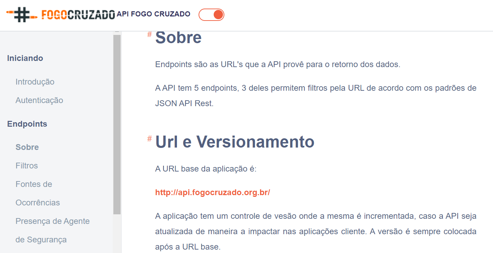

```{r setup, include=FALSE}

options(htmltools.dir.version = FALSE)
knitr::opts_chunk$set(messagwese=FALSE, warning = FALSE)
xaringanthemer::style_mono_accent(base_color ="#23395b", 
                                  title_slide_text_color="#23395b", 
                                  title_slide_background_color = "#fbf9f4", 
                                  background_color = "#fbf9f4", 
                                  link_color =  "#F21A00", 
                                 code_font_size = "60%")

options(htmltools.dir.version = FALSE)
knitr::opts_chunk$set(message=FALSE, warning = FALSE, error=TRUE, cache=TRUE)


``` 

# Our plans for today

1. Introduction to APIs

2. Accessing APIs "manually".

3. Using R packages to access APIs.
    - Twitter API. 
    
---
# Introduction to APIs.

The acronym API corresponds to the term “Application Programming Interface“.

APIs are an online repository built, among other things, to facilitate the exchange of information between data users and the holders.

In the end, you access this repository as you access any website, via URLs. The main difference is that the return is **not an html** and a web page, but **data** in a unestructured format.

<br>

- **Example from Twitter. What would Twitter be like without an API?**

---

## API Uses

There are two main ways in which we academics commonly use APIs.

1. Access data shared by Companies and NGOs. (Twitter, Spotify, Yelp, NYT, Portal da Transparência, IPEA)

2. Process our data in Algorithms developed by third parties. (Perspective API)

- Our focus will be on the first type of APIs.

---

## API usage for data access.

In its simplest form, an API is just a url. See the example below:

`http://mysite.com/key?param_1;param_2`

Main elements:
 
- **http://mysite.com/**: the base of the API, called "the end-point" in most of the documentation.

- **key**: the credentials many sites ask for - not all, as we'll see.

- **?param_1;param_2** parameters, or filters to refine the API search.

To access the API we use the `httr` package. And to clean up the outputs, we'll use several of the `tidyverse` and `jsonlite` functions.

---

# Simple use of APIs.

Let's start with an API in which we don't need to ask for a password. We'll start with a very simple API called [DOG API](https://dog.ceo/dog-api/).

#### Step One: Find Endpoints

Open the website and read the documentation. Endpoints contain the type of information that the API makes available.

#### Step Two: Look for Filters

This API is pretty simple. It has no filters.

#### Step Three: Access via Get.

---
### Example with GET

```{r}
library(httr)
library(tidyverse)
# Acess the API
endpoint = "https://dog.ceo/api/breeds/image/random"

acesso = GET(endpoint)

# examine the objects
class(acesso) 

```

---

## Fourth Step: Access the output using content.

```{r}
# see the element
content(acesso)

# Access the content.

link_image <- content(acesso)$message
download.file(link_image, 
              destfile = "cao.png")
```

---

```{r out.width="80%", echo=FALSE}

```
---

# Crossfire API

Let's now use the Crossfire project API as an example. In this case, the API requires credentials. This should always be our first step.

[Here](https://api.fogocruzado.org.br/) you will find the description on how to gain your access password.

```{r echo=FALSE}

# Activating the packages
library(httr) 
library(jsonlite)
library(tidyverse)

# asking for the password


# get the token
token <- httr::content(get_jwt)$access_token
```

```{r eval=FALSE}

# Activating the packages
library(httr) 
library(jsonlite)
library(tidyverse)

# asking for the password

get_jwt <- httr::POST("https://api.fogocruzado.org.br/api/v1/auth/login",
                 query = list(email = "venturat@umd.edu", password = "xxxxxxxxxx"))


# get the token
#token <- httr::content(get_jwt)$access_token
```

---

## API Endpoint



---

##  API Filters
In the [documentation](https://api.fogocruzado.org.br/docs/1.0/occurrences), it is indicated that there are three main endpoints for the API: cities, states and occurrences.

Let's start with the cities endpoint, an easy one that doesn't require filters. Open this [documentation] link (https://api.fogocruzado.org.br/docs/1.0/cities)


```{r}
# Step 1: Create the URL
base_url <- "https://api.fogocruzado.org.br/api/v1"
cities <- "/cities"
api <- paste0(base_url, cities)
print(api) # somente um site
```

---

### GET Request

To ask for the Api data

```{r}

#  Step 2: Acces the api

response <- GET(api,  
                add_headers('Authorization' = paste("Bearer", token, sep = " ")))

# Result
response
```

---

## Cleaning the Results

The API output is a JSON file - which is a more efficient type for saving large files - and has a status of 200 - which means your access worked.

```{r}
# Convert to a json
json_fogo_cruzado <- content(response, as="text", encoding = "UTF-8")
```


---
## Cleaning Jsons

```{r}
# Cleaning Jsons
output <- fromJSON(json_fogo_cruzado) %>%
              tibble::as_tibble()
output
```

---
## API with Filters. 
All real APIs have parameters to filter accesses.

Filters are added as a filter query in the GET function. These filters must be ordered according to the API documentation.

Let's see [here](https://api.fogocruzado.org.br/docs/1.0/occurrences) some examples

---
## Example of filters

```{r}
# shootings
base_url <- "https://api.fogocruzado.org.br/api/v1"
occurences <- "/occurrences"
api <- paste0(base_url, occurences)
print(api)

# Build a Query
query_list <- list(data_ocorrencia="2019-01-01", 
                   nome_cidade= "Rio de Janeiro")
# GET
response <- GET(api,
                query=query_list,
              add_headers('Authorization' = paste("Bearer", token, sep = " ")))

output <- jsonlite::fromJSON(httr::content(response, as="text", encoding = "UTF-8")) %>%
    tibble::as_tibble()

View(output)

```

---

### Write an entire endpoint.

```{r}
# url basica de ocorrencias.
base_url <- "https://api.fogocruzado.org.br/api/v1"
occurences <- "/occurrences"
filter= "?data_ocorrencia[gt]=2019-01-01&data_ocorrencia[lt]=2019-05-01&CidadeID[]=3661"
api <- paste0(base_url, occurences, filter)
print(api)

# GET
response <- GET(api,
              add_headers('Authorization' = paste("Bearer", token, sep = " ")))

output <- jsonlite::fromJSON(httr::content(response, as="text", encoding = "UTF-8")) %>%
    tibble::as_tibble()

output

```


---
class: center, inverse, middle

## Have we chacked if there exists any package to do all this work for us?

---

## Crossfire

This [link](https://github.com/voltdatalab/crossfire) contains the R package website, and recommendations on how to use it. The installation follows:

```{r eval=FALSE}

#Instalation
install.packages("devtools") # pacote para acessar o github
devtools::install_github("voltdatalab/crossfire")
```

```{r eval=FALSE}
library(crossfire)

# Tell you user

fogocruzado_signin(email = "venturat@umd.edu", password = "xxxxxx")

# Extract the data (same thing we did before)

fogocruzado_rj <- get_fogocruzado(state= "RJ", security_agent = 1)
```


```{r echo=FALSE}
library(crossfire)

# Registra usuario e senha, e envia sua senha da API

crossfire::fogocruzado_signin(email = "venturat@umd.edu", password = "ptds42420678")

# Extrair os dados que pegamos manualmente antes


df <- get_fogocruzado(city = c("Rio de Janeiro", "Recife"),
                                         initial_date = "2018-07-01", final_date = "2018-12-31")

glimpse(df)
```


