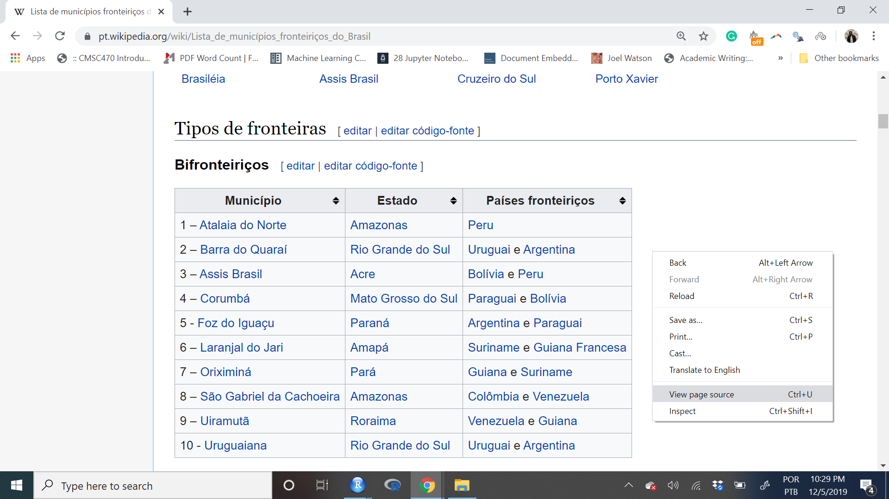
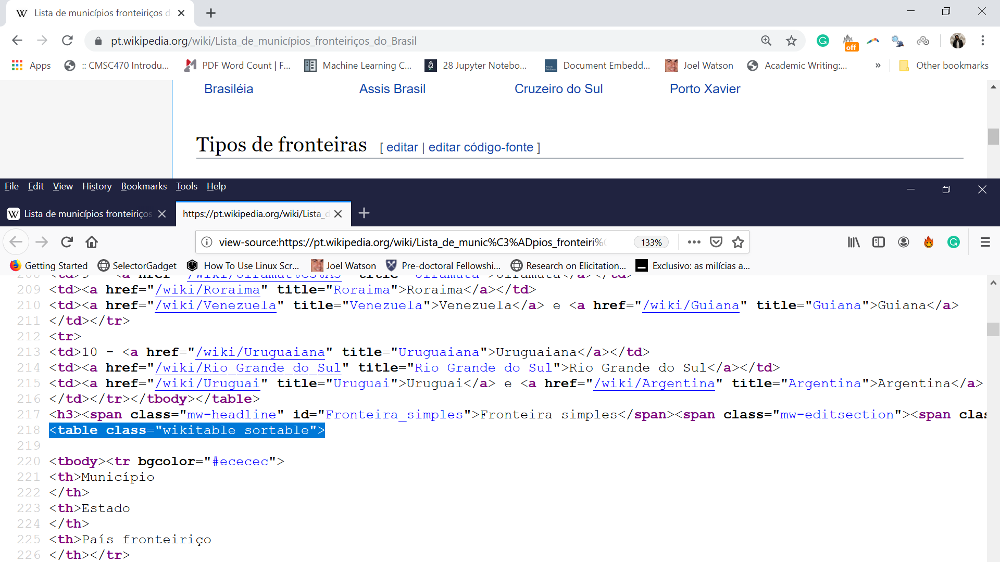

```{r setup, include=FALSE}

options(htmltools.dir.version = FALSE)
knitr::opts_chunk$set(messagwese=FALSE, warning = FALSE)
xaringanthemer::style_mono_accent(base_color ="#23395b", 
                                  title_slide_text_color="#23395b", 
                                  title_slide_background_color = "#fbf9f4", 
                                  background_color = "#fbf9f4", 
                                  link_color =  "#F21A00", 
                                 code_font_size = "60%")

options(htmltools.dir.version = FALSE)
knitr::opts_chunk$set(message=FALSE, warning = FALSE, error=TRUE)


``` 


```{r knitr_init, echo=FALSE, cache=FALSE}

library(knitr)
library(rmdformats)

## Global options
opts_chunk$set(cache=TRUE,
               prompt=FALSE,
               comment=NA,
               message=FALSE,
               warning=FALSE)


```
# Today's Plan:

We will start our journey on how to collect data on/using the internet. 


- Theoretical Notions of Data Scraping

- Basic html

- `rvest` for scraping websites.

- APIs (second part of the class)

---
## Introduction.

There are two main ways to access data on the internet:

1. Scraping data on websites

2. Accessing APIs (Application Programming Interface).


<br><br>

**Accessing data via APIs is safer, more convenient, and faster. Scraping data is harder, and more challenging. Therefore, always choose the APIs, if those exist.**

---
## What is data scraping?

Data scraping consists of building a script to automatically collect data available on-line.

You can alsways do this by hand. However, at scale, this is very likely an impossible task. Then, we need computers to help us out. 


Examples of websites I've collected data from:

- Electoral data at the congress.

- Composition of elites around the world.

- Information on municipalities available on wikipedia,

- Government programs for mayoral candidates in Brazil.

- Price of properties in Rio de Janeiro.


---
## The Basic routine of data scrapping.

--
.pull-left[

### Theoretical

- Find the name of the internet pages you want to scrap

- Download websites in HTML or XML format

- Find the parts of the site that interest you (this is a lot of work)

- Clean and process the data
]

--

.pull-right[

### In R.

- Try with just one site all the steps above.

- Write a function in R for you to automatically repeat the operation. 

- Apply the function to your site list.

]

--

---
class: center, middle inverse

# Scraping Websites

---

## Routines

- Find the website

- Practice with one case

- Become the master in this case

- Write a function to expand the collection

- Save.

---

## Find a website: But what is a website?

HTML + Javascript.

HTML = A language with tags. 

```{r, eval=FALSE}

<html>
<head>
  <title> Michael Cohen's Email </title>
  <script>
    var foot = bar;
  <script>
</head>
<body>
  <div id="payments">
  <h2>Second heading</h2>
  <p class='slick'>information about <br/><i>payments</i></p>
  <p>Just <a href="http://www.google.com">google it!</a></p>
  <table>

```

---

--

class:middle

####  HTMLS tags are the objects we will point in order to scrap the data.

--
```{r, eval=FALSE}

<html>
<head>
  <title> Michael Cohen's Email </title>
  <script>
    var foot = bar;
  <script>
</head>
<body>
  <div id="payments">  #<<
  <h2>Second heading</h2>
  <p class='slick'>information about <br/><i>payments</i></p>
  <p>Just <a href="http://www.google.com">google it!</a></p>
  <table>

```
--

---
## Do I need to learn HTML?

--
.pull-left[
```{r out.width="80%", echo=FALSE}
knitr::include_graphics("https://media.giphy.com/media/cCbf4ryl0UQWBwOLiQ/giphy.gif")
```
]

--

.pull-rigt[

<br>

#### Two paths to scrap website. 

- Inspect the source of the webpages and collect the elements you need 

- Use the [Selector Gadget]("https://selectorgadget.com/")
]

---

## Example 1: Border Municipalities in Brazil.


---
## First Path: Get the Tags manually. 



---
<br>



---

### Let's capture this information using R

```{r}

# Pacotes
#install.packages("tidyverse")
#install.packages("purrr")
#install.packages("rvest")
#install.packages("stringr")
#install.packages("kableExtra")
#install.packages("Rcurl")
library(tidyverse)
library(purrr)
library(rvest)
library(stringr)
library(kableExtra)
library(xml2)

```

---

#### Create a object with the name of the website.

```{r}
minha_url <- "https://pt.wikipedia.org/wiki/Lista_de_munic%C3%ADpios_fronteiri%C3%A7os_do_Brasil"
```

#### Capture the html as a new object.

```{r}

source <- read_html(minha_url)
```

#### Examine the object.

```{r}
class(source) # XML=HTML
```

---

## html_table(): to extract the table tag.

```{r}
tabelas <- source %>% 
            html_table() 
```

#### What is this object?

```{r}
tabelas[[3]]
```

---

### Clean ans save our first output. 

```{r}
tabela_limpa <- tabelas[[3]] %>% 
            
            # make it a tibble 
            as.tibble() %>% 
  
            # new variables
            mutate(city = Município, 
                   uf_name = Estado) %>%
            select(city, uf_name) %>%
            
            # fix enconding
            mutate(city = str_sub(city,5),
                   city = str_replace(city, pattern="- ", ""), 
                   city =  str_trim(city),
                   city_key = stringi::stri_trans_general(city, "Latin-ASCII"), 
                   city_key= str_replace_all(city_key, " ", ""), 
                   city_key=str_to_lower(city_key)) 

tabela_limpa

```

---

# Path 2: Scrapping using CSS Selection. 
Scraping data from tables is an easy task.

Everything gets more complicated when websites have more complex structures, and we need to use HTML tags (called CSS). For this, we will use the CSS Selector Gadget.

In this example, I will access the private page of each of the 71 deputies of the Legislative Assembly of the State of Rio de Janeiro. Let's go:

- Name
- Email
- Biography
- Political Party

---

### An example with CSS Selector. 


---

### Steps using the CSS Selector. 

- Enable CSS on your browser,

- Click on the information you want to extract -> Yellow.

- A second click if you are capturing more than you need.

- Repeat this until you isolate your target of interest.

- Copy and paste the result into the `html_nodes()` function

---

### Extracting the names (`html_text`)

```{r}
# Capture the names
minha_url <- "http://www.alerj.rj.gov.br/Deputados/QuemSao"

nomes <- read_html(minha_url) %>%
          html_nodes(css=".nome a") %>%
          html_text() #<<

# Clean the names

nomes_limpos <- nomes %>% 
                  str_to_title()

nomes_limpos

```

---

### Capturing the links. (`html_attr`)


```{r}

links <- read_html(minha_url) %>%
          html_nodes(css=".nome a") %>%
          html_attr("href") #<<

# Combine the links. 

links <- paste0("http://www.alerj.rj.gov.br/", links)

# Build a dataset

dados <- tibble(nomes=nomes, 
                links=links)


```

---

### Scrapping one case (master this first)


```{r}

# url
link <- dados$links[[1]]

#source
source <- link %>% read_html()

# Information

nome <- source %>%
            html_nodes(css=".paginacao_deputados .titulo") %>%
            html_text() %>%
              str_remove_all(., "\\r|\\n") %>%
              str_trim() %>%
              str_squish()


partido <-  source %>% 
              html_nodes(css=".partido") %>%
              html_text() 

biografia <- source %>% 
            html_nodes(css=".margintop11") %>%
            html_text() %>% 
            paste0(., collapse = " ")


telefone <- source %>% 
    html_nodes(css=".margin_bottom_5+ p") %>%
    html_text()

email <- source %>% 
    html_nodes(css="#formVisualizarPerfilDeputado p+ p") %>%
    html_text()

# Combine all the relevant information.

deputados <- tibble(nome, link, partido, biografia, telefone, email)
```

---
```{r}
deputados
```

--

#### And now?

--

We have now finished our first step. We need to expand this to all deputies.


  - Convert our code to a function.
 
  - Apply the function to a list of links (Functional programming)
  
  - Great that we learned more about functions yesterday!
  
--

---

### Functional Programming and Data Scraping.

In the previous code, we created a snippet of code to scrape data for one case.

However, our goal is to scrape data for millions of cases, and let our computer do the work while we think about other things.


For this task, we should use the skills we learned on **functional programming**

---
## What is functional programming?

The fundamental idea of functional programming is to prepare all your code in terms of distinct functions. And apply this function to similar cases.

**Data Scraping**: write a function that allows us to repeat what we did for a case for the other pages we intend to scrape.

With this function written, we only have to apply it to multiple elements. We do this using the map functions from `purrr`

---
### Writing your master function (for one case)

```{r}

raspar_alerj <- function(url){

source <- url %>% read_html()

# informacao

nome <- source %>%
            html_nodes(css=".paginacao_deputados .titulo") %>%
            html_text() %>% str_remove_all(., "\\r|\\n") %>%
              str_trim() %>% str_squish()
partido <-  source %>% 
              html_nodes(css=".partido") %>%
              html_text() 
biografia <- source %>% 
            html_nodes(css=".margintop11") %>%
            html_text() %>%   paste0(., collapse = " ")
telefone <- source %>% 
            html_nodes(css=".margin_bottom_5+ p") %>%
            html_text() %>%   paste0(., collapse = " ")
email <- source %>% 
            html_nodes(css="#formVisualizarPerfilDeputado p+ p") %>%
            html_text() %>%  paste0(., collapse = " ") 

# Combina tudo como um banco de dados

deputados <- tibble(nome, link, partido, biografia, telefone, email)

# Output

return(deputados)

# Putting your R to sleep a bit. 

Sys.sleep(sample(1:3, 1))

}

```

---
### Apply to one case

```{r}
raspar_alerj(dados$links[[5]]) # does it work?
```

---
### Purrr and Data Scraping.

Now we have the two missing pieces to finish our tutorial:

1. One function designed to scrape our cases, and

2. A way to automate this journey from case to case (purrr).

Let's implement it now.

```{r}

# convert all the cases to a list
lista_links <- as.list(dados$links[1:10])

# apply our function to the list of links/

dados <- map(lista_links, raspar_alerj) 

# bind all the cases as a new data frame
dados_alerj <- bind_rows(dados)
```

---
### Result
```{r}
dados_alerj
```

---
class: center, middle


---
 
### Saving

```{r}
write.csv(dados_alerj, "deputados_alerj.csv")
```

---
### More, and more

I have a bunch of codes scrapping on-line data. 

And you can find a lot of different tutorials on-line. 

If you want more codes to practice, let me know. I am happy to email you with a few examples. 

---
### Homework. 

I actually prepared a homework for you this afternoon. Hope you have fun. Instructions:

In this exercise, you will create a complete scraping program in R. Our objective is to collect all the information from the [agenda](https://www.gov.br/planalto/pt-br/acompanhe-o-planalto/agenda-do-president-da-republica/2020-01 -01) of President Bolsonaro in the year 2020 and 2021.

You need:

1. Write code to gather information.

2. Capture the information and store it in a data frame.

3. This data frame must have the following columns: day, time, meeting description.

4. Print a summary of the data frame at the end of the code, using the glimpse.


